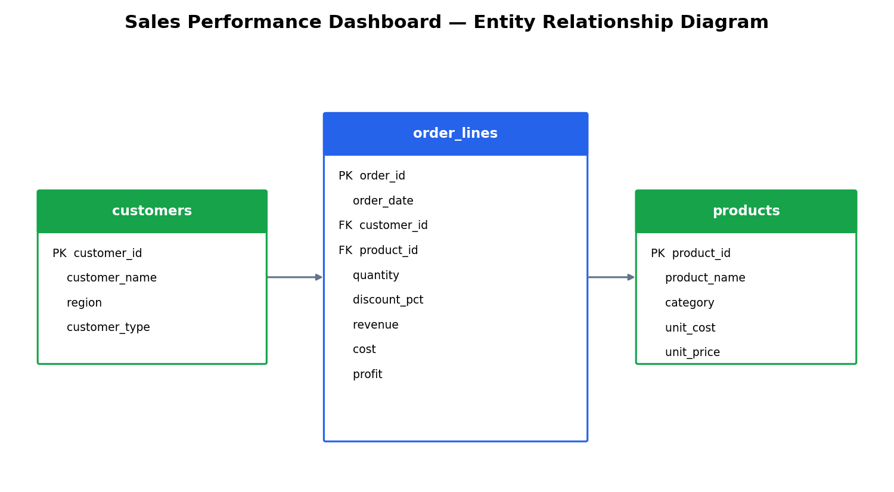
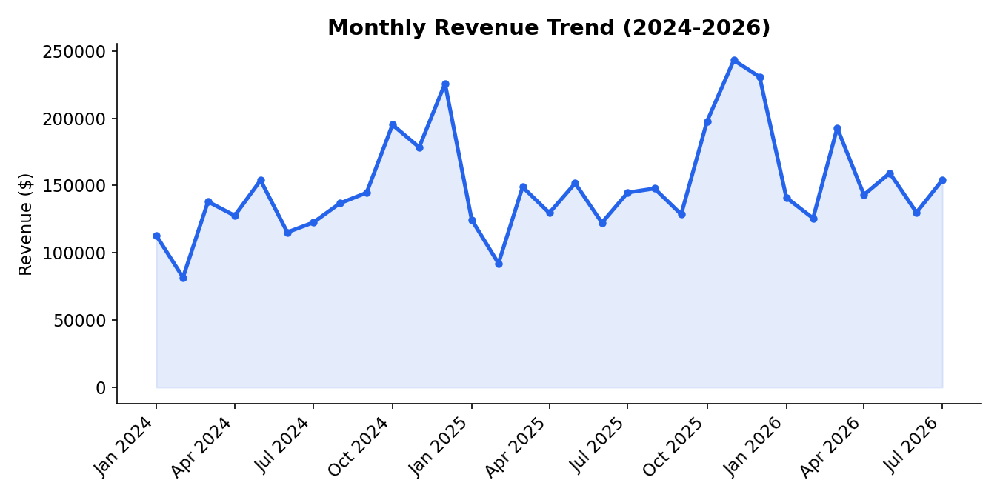
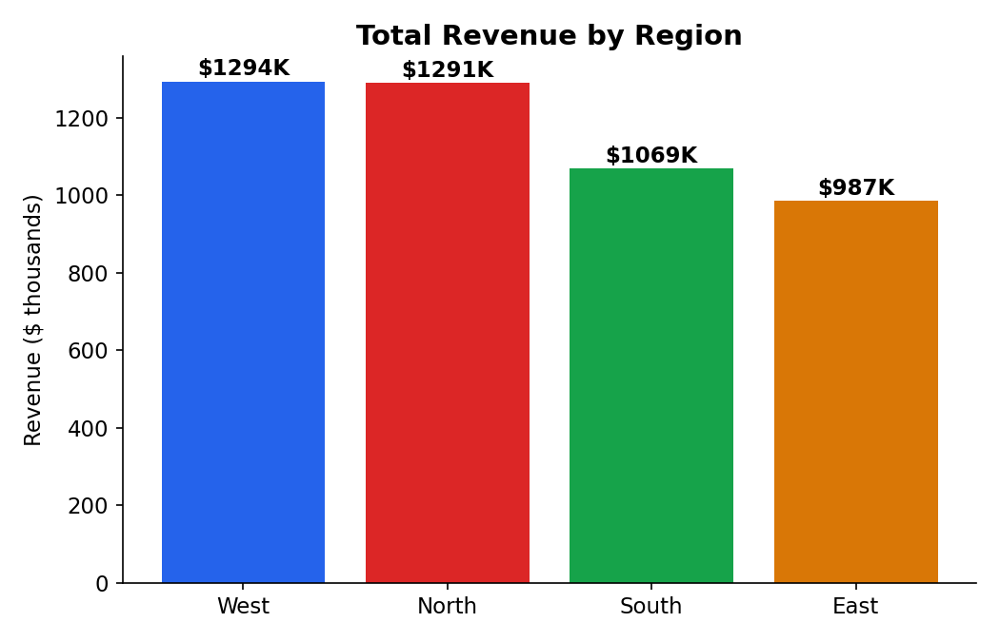
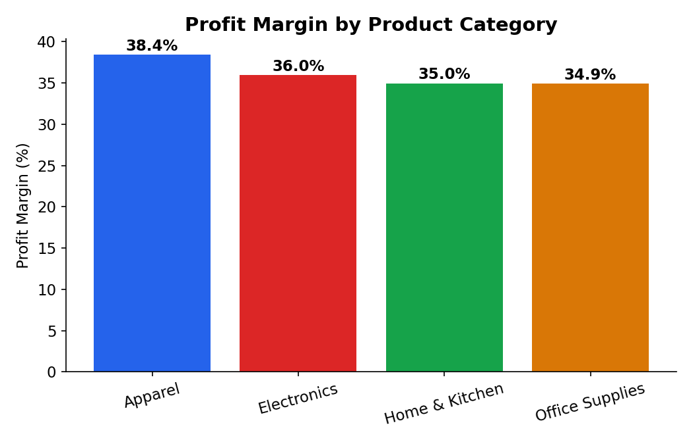
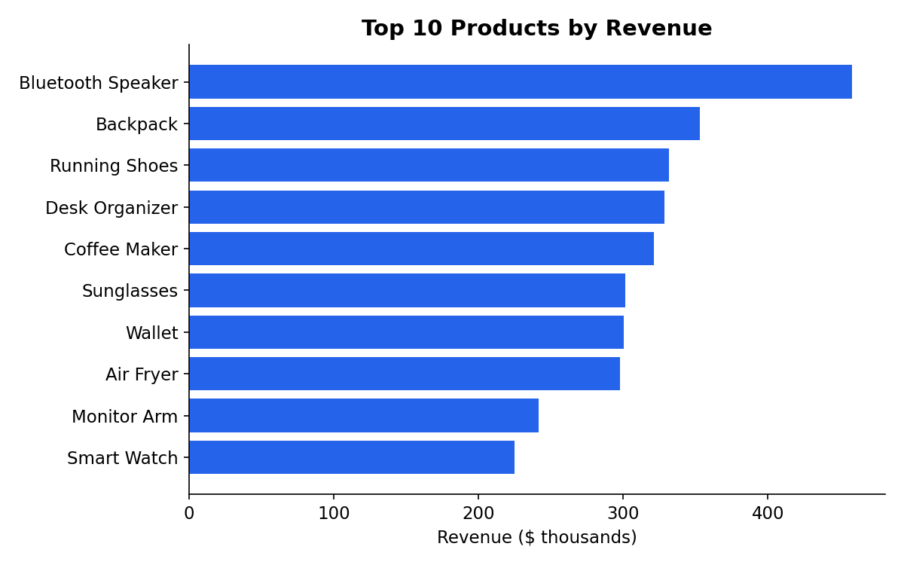
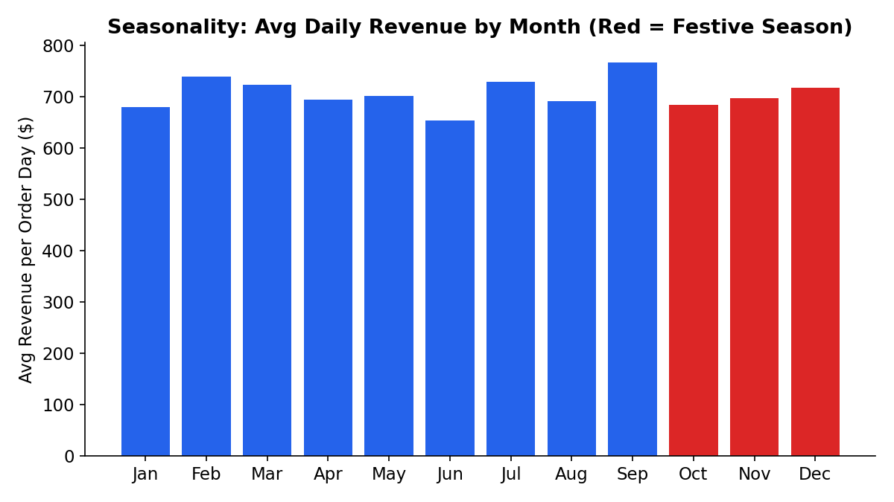

[README.md](https://github.com/user-attachments/files/30928223/README.md)
# Sales Performance Executive Dashboard

An end-to-end sales analytics project simulating a multi-region retail/distribution
business across 3 fiscal years (2024–2026), built with SQL, Python, and Power BI.

## Business Problem
Leadership has no single view of revenue, profit, and growth trends across regions,
categories, and customer types — decisions are being made on gut feel rather than data.

## Business Objectives
- Track revenue, profit, and margin with MoM/YoY growth
- Identify top- and bottom-performing regions, categories, and products
- Understand customer-type behavior (Retail vs Wholesale vs Online) and average order value
- Give category/product managers a self-serve dashboard instead of ad hoc spreadsheet pulls

## Tech Stack
SQL (PostgreSQL syntax) · Python (pandas) · Power BI (DAX, Power Query) · Excel-compatible CSV exports

## Repository Structure
```
sales-project/
├── data/
│   ├── sales_orders.csv              # 6,583 order lines, 2024-01 to 2026-07
│   ├── products.csv                  # 20 SKUs across 4 categories
│   ├── customers.csv                 # 400 customers across 4 regions
│   ├── sales_kpis.json               # headline KPIs
│   └── monthly_revenue_growth.csv    # MoM/YoY growth series
├── sql/
│   ├── 01_schema.sql                 # normalized schema (DDL)
│   └── 02_analysis_queries.sql       # KPIs, CTEs, window functions, view, function
├── python/
│   ├── generate_dataset.py           # synthetic data generator (with seasonality)
│   └── eda_analysis.py               # KPI, growth, region/category/product analysis
├── powerbi/
│   └── dashboard_specification.md    # DAX, Power Query, wireframes
└── README.md
```

## Visuals

**Entity Relationship Diagram**


**Monthly Revenue Trend**


**Revenue by Region**


**Margin by Category**


**Top 10 Products**


**Seasonality**


## Key Findings
- **Total revenue: $4.64M**, total profit **$1.68M**, blended margin **36.2%**
- **6,583 orders**, average order value **$705**
- Clear **seasonality**: Oct–Dec revenue runs 40–60% above baseline (festive season)
- **West** and **North** regions lead revenue; margin is consistent (~36%) across all regions
- **Apparel** has the highest category margin (38.4%) despite not being the top-revenue category
- Revenue grew ~12% YoY by design; recent months show YoY growth in the 5–36% range with
  month-to-month volatility driven by seasonality

## Business Recommendations
1. **Inventory & staffing planning** around the Oct–Dec seasonal peak
2. **Push Apparel category** further — highest margin, room to grow revenue share
3. **Investigate East region** — lowest revenue; check pricing, assortment, or marketing spend
4. **Wholesale AOV analysis** — compare against Retail/Online to right-size volume discounts

## How to Reproduce
```bash
python python/generate_dataset.py
python python/eda_analysis.py
psql -f sql/01_schema.sql
psql -f sql/02_analysis_queries.sql
```
Then open Power BI Desktop, import `data/sales_orders.csv`, and follow
`powerbi/dashboard_specification.md`.

## License
MIT
